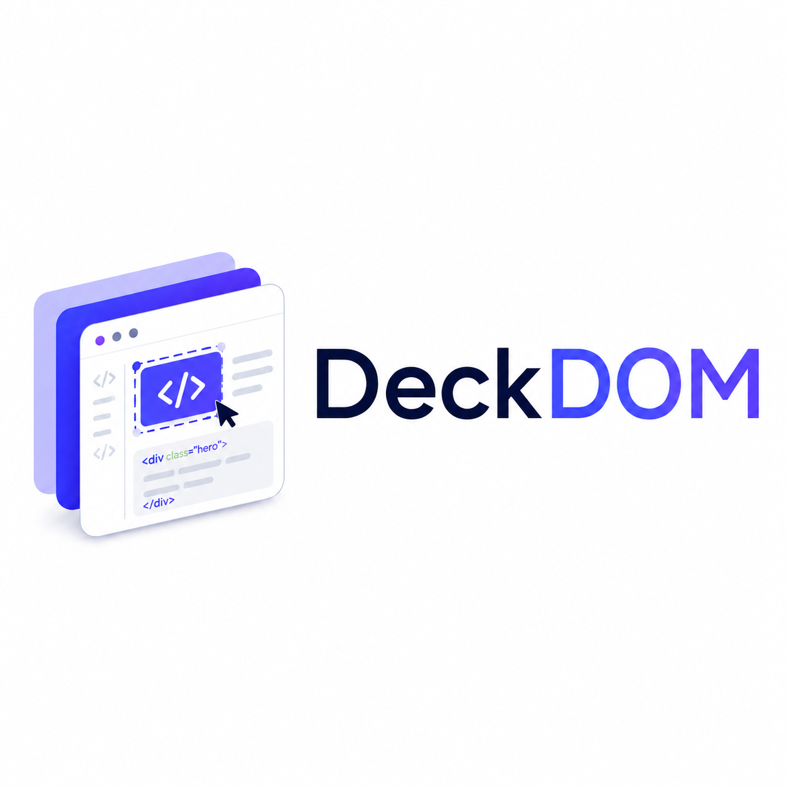

# DeckDOM

<p align="center">
  
</p>

<p align="center">
  面向办公场景的 HTML 可视化编辑器
</p>

<p align="center">
  
  
  
  
  
</p>

## 快速启动

### 1. 准备运行环境

请先安装以下任一 Node.js 版本：

- Node.js `^20.19.0`
- Node.js `>=22.12.0`

### 2. 安装项目依赖

```powershell
npm install
```

### 3. 启动开发服务器

```powershell
npm run dev
```

Vite 启动后会在终端显示本地访问地址。使用最新版桌面 Chrome 或 Edge 打开该地址，即可进入 DeckDOM。

### 4. 开始编辑

打开应用后：

1. 点击“选择本地 HTML”。
2. 阅读受信任输入提示，确认文件来源可信后继续。
3. 选择一个本地 `.html` 文件。
4. 在工作台中选择文字、图片或普通容器进行编辑。
5. 使用“预览”检查页面效果和原有交互。
6. 点击“导出 HTML”下载修改后的独立文件。

> DeckDOM 会运行所选 HTML 中的脚本、网络请求和交互。请勿打开来源不明或不受信任的文件。

## 项目介绍

DeckDOM 用来修改已经生成好的单文件 HTML 展示文档。它面向不希望直接编辑 HTML、CSS 或 JavaScript 的用户，让用户以接近演示文稿软件的方式，直接选择页面中的内容并完成常见修改。

项目重点解决以下问题：

- AI 或其他工具生成 HTML 后，少量内容调整仍需要反复生成或手工改代码。
- 传统演示文稿工具通常会把网页转换成固定页面，难以保留原有布局、滚动、动画和交互。
- 用户需要得到可以独立打开的 HTML 文件，而不是只能在特定编辑器中使用的项目格式。

DeckDOM 的核心特点：

- **直接编辑渲染结果**：在真实浏览器渲染位置选择和修改内容，不需要查看源码。
- **优先保留原页面**：继续使用原 HTML、CSS、脚本、布局、动画和交互，不转换成统一的幻灯片模型。
- **非破坏性修改**：编辑内容记录在独立修改层中，原始本地 HTML 文件不会被覆盖。
- **本地优先处理**：导入、修改、自动保存和导出主要在浏览器中完成，无需登录。
- **单文件交付**：编辑完成后导出新的 HTML 文件，可脱离 DeckDOM 独立打开。

DeckDOM 适合处理翻页式 HTML 演示、长滚动展示页面，以及其他以单个 `.html` 文件交付的可视化内容。它本身不负责生成 HTML，也不承诺任意网页中的所有内容都可以编辑。

## 使用方法

### 1. 导入 HTML

- 点击顶部工具栏或空白工作台中的“选择本地 HTML”。
- 只能选择一个 `.html` 文件，不支持 ZIP、资源目录或前端源码工程。
- 导入前必须确认文件可信，因为原 HTML 中的脚本和网络请求会真实运行。
- 导入成功后，页面会作为工作副本加载到中央区域，原始本地文件保持不变。
- 如果存在缺失的相对资源或外部资源加载失败，工作台会显示资源状态和诊断信息。

### 2. 选择页面对象

- 在工作副本中单击文字、图片或普通容器进行选择。
- 使用左侧 HTML 层级树查看、搜索和选择页面对象。
- 点击“选择父容器”可以沿原 HTML 层级向上选择容器。
- 对象路径、层级树、属性面板和蓝色选框会保持同步。
- 单击画布空白处或按 `Esc` 可以取消当前选择。
- 复杂对象会显示为“整体对象”或“锁定”，以避免不可靠的修改破坏原页面。

### 3. 编辑文字

- 双击文字对象，可以直接在原渲染位置编辑内容。
- 就地编辑会尽量保留原有的强调、链接等内联结构。
- 从外部粘贴的富文本会按纯文本处理，避免引入额外 HTML 格式。
- 右侧属性面板可以替换整个文字对象；如果替换会清除内部格式，应用会先请求确认。
- 可以为整个文字对象设置字体族、字号、字重、字形、行高、字间距、对齐方式和文字颜色。
- 文字变化按照原页面 CSS 自然换行和重排，结果会立即显示在工作副本中。

### 4. 替换图片

- 选择普通图片后，在右侧点击“从本地替换图片”。
- 应用会先验证所选文件是否为可加载的图片，不支持的数据不会改变当前项目。
- 图片验证成功后可以选择两种适配方式：
  - **直接替换**：保留新图片自身比例，并继续遵循原页面的布局和 CSS；这是默认方式。
  - **填充原图框**：记录原图片在当前参考视口中的显示框，并使用居中的 `object-fit: cover` 填满该区域。
- “填充原图框”只在渲染时隐藏框外内容，不会裁剪、拉伸或改写图片像素。
- 本地替换图片会随项目保存，并在导出时内嵌到 HTML 文件中。

### 5. 调整对象外观

选中文字、图片或普通容器后，可以在右侧属性面板设置：

- 背景颜色
- 边框颜色
- 边框样式
- 边框宽度
- 圆角

这些设置只覆盖当前对象，不会改写原有共享 CSS，也不会批量影响使用相同类名的其他对象或当前容器的后代。

### 6. 移动与缩放对象

- 拖动蓝色对象标签，可以对选中对象进行视觉位移。
- 拖动选框四角手柄，可以保持纵横比进行视觉缩放。
- 移动和缩放不会改变对象在原文档流、Flex 或 Grid 布局中的占位。
- 操作造成的空白或重叠会按真实结果保留，页面不会自动重新排版补位。
- 对象原有的 CSS 变换会继续与 DeckDOM 的视觉修改组合生效。

### 7. 操作和预览原页面

编辑模式提供两种画布工具：

- **选择内容**：默认工具。点击和拖动用于选择、移动或缩放对象，原 HTML 的链接、按钮和页面快捷键不会被误触。
- **操作页面**：临时把点击和键盘操作交还给原 HTML，适合翻页、切换主题、使用导航或操作原页面组件。按 `Esc` 返回“选择内容”。

切换到“预览”后，编辑选框和操作层会停用，原页面的点击、键盘、滚动、动画和交互会恢复。返回编辑模式不会丢失已有修改，也不会产生额外的撤销步骤。

### 8. 撤销、重做与恢复项目

- 文字、字体、图片、外观、视觉位移和视觉缩放共享同一套编辑历史。
- 每次完整操作按一次用户意图记录，拖动过程不会拆成大量历史步骤。
- 可以使用工具栏或快捷键撤销、重做。
- 撤销后执行新修改时，旧的重做分支会被清除。
- 每次提交修改后，原始 HTML、当前修改和编辑历史会自动保存在浏览器本地。
- 刷新页面或重新打开应用时，可以恢复最近编辑的项目。
- 如果浏览器存储空间不足、保存失败或最近项目损坏，界面会明确显示错误和恢复入口，不会伪装成保存成功。

### 9. 导出 HTML

- 点击顶部“导出 HTML”，会下载一个新的 `<原文件名>-edited.html` 文件。
- 导出文件会固化文字、图片、外观、位置和缩放等当前修改。
- 本地替换的图片会内嵌到文件中，不再依赖原本地图片路径。
- 编辑器选框、工具栏和属性面板不会进入导出内容。
- 原页面的结构、样式、脚本、动画和交互会尽量保留。
- 导出的 HTML 可以脱离 DeckDOM 独立打开，原始上传文件不会被覆盖。

## 功能一览

### HTML 导入与保真

- 导入单个本地 HTML 文件。
- 保留翻页式文档、长滚动页面和响应式布局的原有形态。
- 直接运行原页面，而不是转换成截图、幻灯片或统一组件模型。
- 对非 HTML 文件、无法载入的内容和缺失资源提供明确诊断。

### 对象发现与层级选择

- 自动识别文字、普通图片和普通容器。
- 显示可编辑、整体对象和锁定状态。
- 支持工作副本点击、层级树搜索和父容器选择。
- 允许从已选容器内部继续选择更小的子对象。

### 所见即所得编辑

- 在真实浏览器渲染结果上编辑文字、图片和外观。
- 属性调整过程中连续预览，保存后形成一个历史步骤。
- 编辑辅助界面与最终 HTML 内容相互分离。
- 编辑模式冻结 CSS 动画和过渡，预览时恢复原定义和播放行为。

### 参考视口与画布缩放

- 默认参考视口为 `1440 × 900`。
- 可以输入其他桌面宽高，让原 HTML 的响应式 CSS 按真实 iframe 视口重新布局。
- 支持放大、缩小和“适合画布”。
- 画布缩放只改变工作台中的显示比例，不会改变 HTML 的布局尺寸。
- 长页面可以继续滚动，翻页式文档继续使用自身的页面状态。

### 统一历史与本地恢复

- 所有已支持的编辑类型共用撤销和重做历史。
- 自动保存原始内容、修改层、参考视口、模式和历史状态。
- 支持刷新恢复、重新打开后恢复以及损坏项目清理。
- 保存异常会明确提示用户立即导出，避免误认为修改已经安全保存。

### 独立 HTML 交付

- 导出新的单文件 HTML，不覆盖原始文件。
- 固化当前已支持的编辑结果。
- 内嵌用户本地替换的图片。
- 保留原 HTML 的主要结构、CSS、脚本和交互。
- 导出文件不依赖 DeckDOM 运行。

## 常用快捷键

| 快捷键 | 作用 | 使用范围 |
| --- | --- | --- |
| `Ctrl+Z` | 撤销 | 编辑模式的“选择内容”工具 |
| `Ctrl+Y` | 重做 | 编辑模式的“选择内容”工具 |
| `Ctrl+Shift+Z` | 重做 | 编辑模式的“选择内容”工具 |
| `Esc` | 取消选择，或从“操作页面”返回“选择内容” | 编辑模式 |

在 macOS 浏览器中，历史快捷键也支持使用 `Command` 代替 `Ctrl`。

## 使用限制与安全提示

### 输入范围

- 当前只接受单个 `.html` 文件。
- 不支持 ZIP、资源文件夹、多文件网站、React/Vue 源码工程或其他项目目录。
- DeckDOM 不提供 HTML、CSS 或 JavaScript 源码编辑入口。

### 受信任输入

- 导入的 HTML 会在浏览器中运行自己的脚本、事件处理和网络请求。
- 工作副本所在的 iframe 用于隔离编辑器界面布局，不是不可信代码的安全沙箱。
- 只应打开由自己创建、已经检查或来源明确可信的文件。

### 本地处理不等于完全离线

- 用户选择的 HTML、替换图片、修改记录和导出过程不会主动上传到 DeckDOM 产品服务器。
- 原 HTML 中的外部图片、字体、样式、脚本和其他网络请求仍可能访问第三方服务。
- 当前版本不会自动下载并打包原文档已有的全部外部资源；导出的文件仍可能依赖网络。

### 编辑能力边界

- 当前重点支持文字、普通图片和普通容器。
- SVG、Canvas、视频、iframe、图表和复杂组件可能只能作为整体选择，或保持锁定状态。
- 不支持新增对象、多选对齐、旋转、自由拉伸、源码编辑、AI 生成或多人协作。
- 当导入保真与完全可编辑发生冲突时，DeckDOM 会优先保留原页面效果。
- 修改结果只保证在当前参考视口下符合预期，不代表已经为所有屏幕尺寸建立响应式编辑规则。

### 本地数据与导出

- 自动保存的数据由浏览器管理，清除站点数据、浏览器设置或系统清理操作都可能删除最近项目。
- HTML 导出文件是当前由用户主动带走的成果文件，请在重要修改后及时导出备份。
- 导出文件会保留原 HTML 尚未内嵌的外部依赖，其离线能力取决于原文档本身。

## 浏览器支持

DeckDOM 当前正式支持：

- 最新版桌面 Google Chrome
- 最新版桌面 Microsoft Edge

以下环境不在当前兼容保证范围内：

- 手机和平板浏览器
- Firefox 和 Safari
- 旧版 Chrome 或 Edge
- 其他非 Chromium 浏览器

自动化端到端测试在真实桌面 Chromium 环境中运行。Edge 支持基于共同的 Chromium 平台和人工兼容检查，不代表每次发布都会单独运行完整 Edge 自动化套件。

## 项目验证

构建生产版本：

```powershell
npm run build
```

在本地预览构建结果：

```powershell
npm run preview
```

运行端到端测试：

```powershell
npm run test:e2e
```

端到端测试使用真实桌面 Chromium，并直接载入以下两份未经预处理的验收样例：

- `testexample/test1.html`：翻页式 HTML 展示文档。
- `testexample/test2.html`：长滚动响应式 HTML 展示文档。

这两份样例验证导入、选择、编辑、预览、本地恢复和导出闭环，但不代表 DeckDOM 支持所有结构的 HTML。新的文档形态仍需要增加相应的验收证据。

## 技术栈

- JavaScript ES Modules
- Vite `7.1.2`
- Playwright `1.54.2`
- 浏览器原生 DOM、iframe、File API 和本地存储能力

## 许可证

本项目采用 [MIT License](./LICENSE)。
